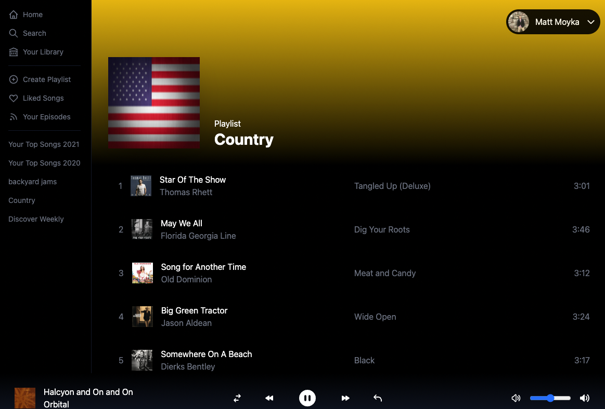

# Spotify Clone

# [Click here to view deployed site](https://spotify-clone-dusky.vercel.app/login)


- [Overview](#overview)
- [MVP](#mvp)
  - [Goals](#goals)
  - [Libraries and Dependencies](#libraries-and-dependencies)
  - [Client (Front End)](#client-front-end)
    - [Wireframes](#wireframes)
- [Code Showcase](#code-showcase)


<br>

## Overview

_**Spotify Clone** is a clone of the spotify web player._


<br>

## MVP


_The **Spotify Clone** MVP will consist of a play, pause, skip, reverse and volume controlls. As well as play songs from existing playlists you have created. All of this functionality will be pulled through spotify api._

<br>

### Goals

- Replicate the look and functions of spotify.


<br>

### Libraries and Dependencies


|     Library      | Description                                |
| :--------------: | :----------------------------------------- |
|      Next.js 12       | Front end framework.|
| Tailwind CSS | Elegant Styling. |
| Recoil | State Management |
|     Spotify Api     | Backend framework.|


<br>

### Client (Front End)

#### Wireframes


- Spotify Player Clone



## Code Showcase
A code snippet displaying the use of Next.js 12 middleware.
  ```
  import { getToken } from "next-auth/jwt";
import { NextResponse } from "next/server";
export async function middleware(req) {
  const token = await getToken({
    req, secret: process.env.JWT_SECRET, secureCookie:
      process.env.NEXTAUTH_URL?.startsWith("https://") ??
      !!process.env.VERCEL_URL
  });
  const { pathname } = req.nextUrl

  if (pathname.includes('/api/auth') || token) {
    return NextResponse.next()
  }

  if (!token && pathname !== '/login') {
    return NextResponse.redirect("/login")
  }

}
  ```